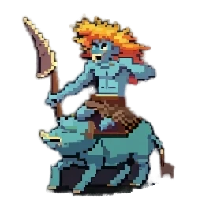
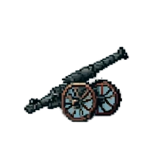
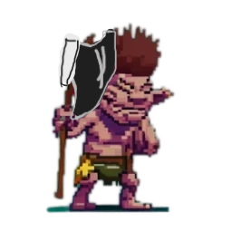

</img>
</img>
</img>

# 🛡️ Axes & Trolls 🪓

Welcome to the Axes & Trolls page! Here, delve into the creating of this strategy board-game experience. Whether you’re interested in contributing to the project, understanding the game’s structure, or diving into the codebase, this is your go-to resource.

## ⚙️ Project Overview
Axes & Trolls is a strategy game that combines old and new strategy features from board games into a videogame. Local Play with friends to battle out is the current way to go. With this in mind, new features and extensibility is welcome.

## 🗂️ Resources

#### Official Website 🌐: Explore the full game experience, access the rulebook, game instructions, and more.

#### Code Documentation 📚: Visit the "docs" folder for detailed information about the code structure.

#### Contribution Guidelines 🤝: Learn how to contribute to the project, from submitting bug reports to developing new features.

#### License 📜: Review the licensing terms that govern the use and distribution of Axes & Trolls.

## 📌 Getting Started with Contributions

#### Clone the Repository 🛠️: Start by cloning the project from our GitHub repository.

#### Review the Docs 📄: Familiarize yourself with the codebase by reading through our documentation.

#### Follow the Guidelines ✔️: Before contributing, please review our contribution guidelines to ensure a smooth collaboration process.

