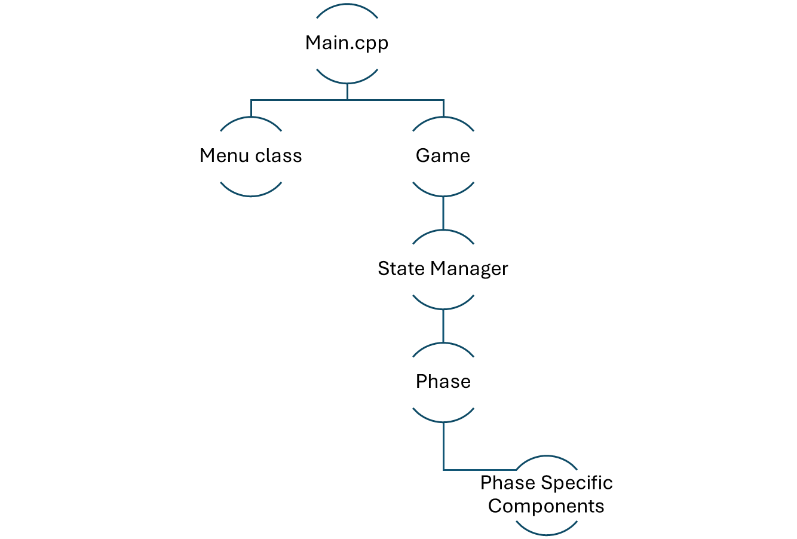

## Hierarchy
### *Top Level:*

### 1. Menu

Renders the menu until a game has been started.

### 2. GameInitializer

A helper class for initializing game. This class is responsible for the transition from menu to game.

### 3. Game

Handles all responsiveness, rendering and back-end logic with it's members once  a game has been initialized.
### State and Graphics managers
Once the game is started, the Game takes over the game logic using the following two classes:

- GameStateManager
    - Handles most of the game logic, like:
    Keeping track of Players, Units, Tiles etc. 
- GameGraphicsManager
    - Renders the graphic representations of objects.

### Phases
The game is initialized using a GameInitializer class, but for the rest of the game, the logics is controlled by Phases.

See "Phase.hpp", with the following subclasses:
- Placement phase:
    - Only occurs once. This is where players place their first city.
- Buy phase:
    - The start of each players turn, self explanatory. :p
- Move Phase, "CombatMovePhase.hpp".
    - The player moves their units.
- Combat Phase:
    - The "contested areas" are to be resolved by battling.
- Reinforcement Phase:
    - Placement of purchased buildings and units.

Phases all have a function that returns a pointer to a new phase of the *next phase* class.

### Handle Event

### Passed through to lower level components

The function is responsible for handling responsiveness.

### Draw

### Passed through to lower level components

This function is always initiated from the top through graphics manager and is responsible for drawing all elements.

  

### Key Components
 - Unit
 - Building
 - Tile

### Graphical representation

Instead of having their own "draw" functions, they are paired up with graphical components when needed.

#### Tile - Tileview
As Tiles are drawn constantly, they have their own specific view - see TileView.hpp.

#### Buildings and Units

- Buildings are drawn on top of tiles as part of TileViews.
- Units are displayed as needed:
    - Tileview has a count displaying system.
    - CurrentTileView in the move phase shows a graphic of the units and their count.
    - The battle window also has unit graphics.

## Topics & Related Classes

## Game progression
 - GameStateManager
 - Phase
## Map
 - GameStateManager
 - Tile
 - Randoms
 - GameGraphicsManager
 - MapView
 - TileView
    
## Movement
 - Unit
 - Movement
 - MovementHandler
 - Player
 - CombatMovePhase - "Move Phase"
 - CurrentTileView
 - UnitView

## Battle
 - CombatPhase
 - BattleWindow
 - UnitView
 - DiceView
 - BattleSimulator
 - Randoms

## Tile
 - Tile
 - TileView
 - TileType
 - Player
 - Unit
 - Building

## Unit
 - Unit
 - UnitType
 - Player
 - Tile
 - TileType

## Player
 - Player
 - MovementHandler
 - Territory
 - Tile
 - Unit
 - GameStateManager
 - PlayerView
 - GameInitializer
